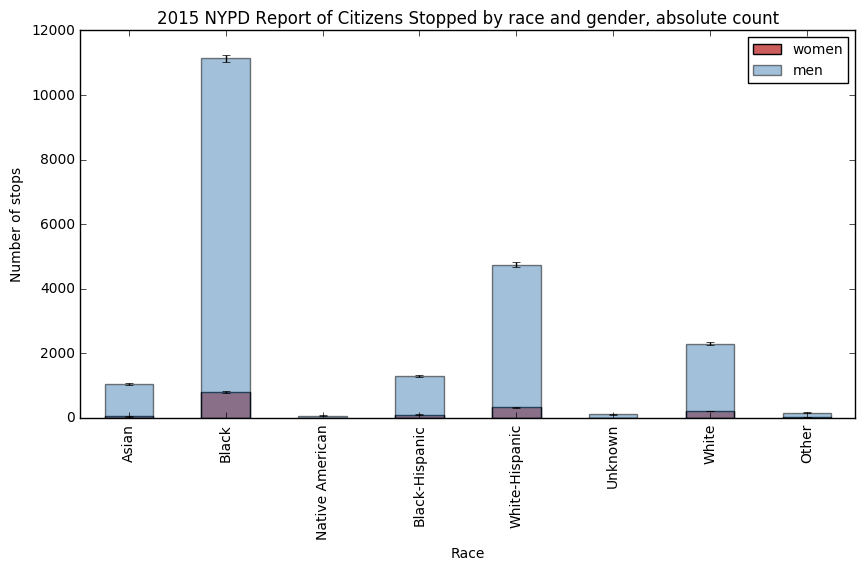
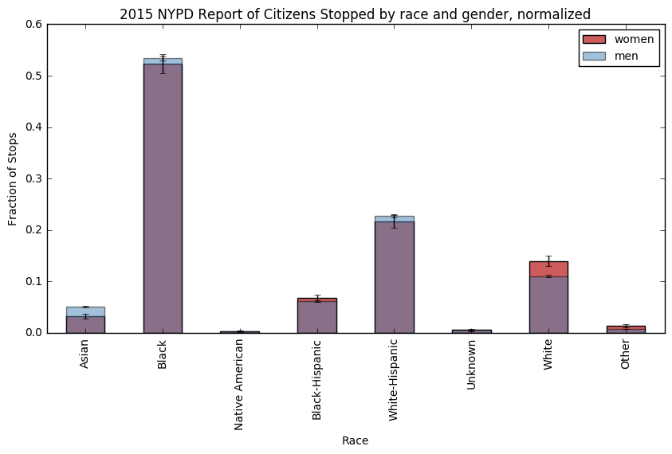

Hey Franz,

This is an interesting analysis of inequality by race and gender. The data and the analysis is clear through the start. 

It is good idea to show both the plots and observe the difference between the plots with normalized data and absolute data.
The addition of error to the lot shows the reader the account of statistical error in dataset. 

My suggestion would be droping the 'Unknown' category as in both the plots its approximately zero. So it makes more sense to drop it. 

The inference/caption from the normalized plot is missing and could add to the understanding of plot. 

